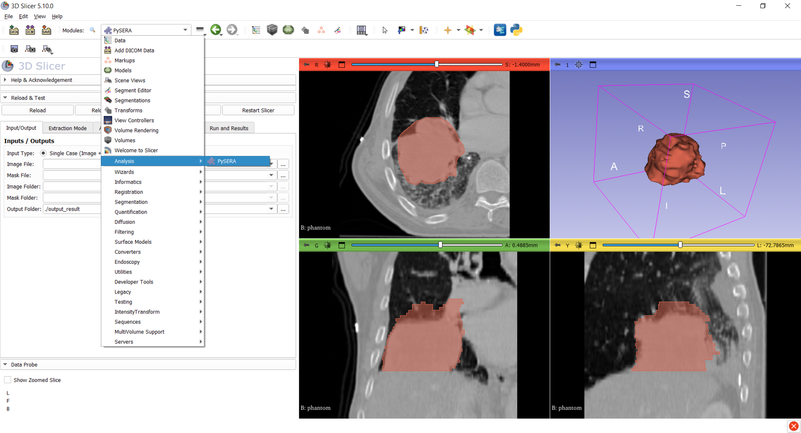
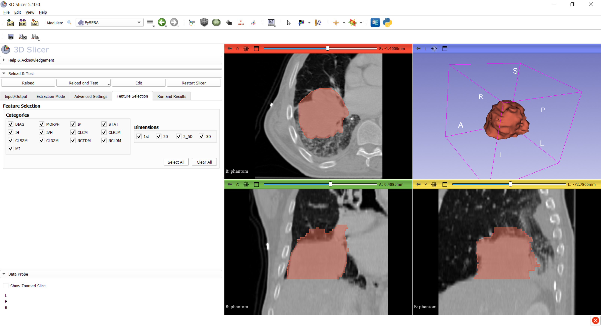
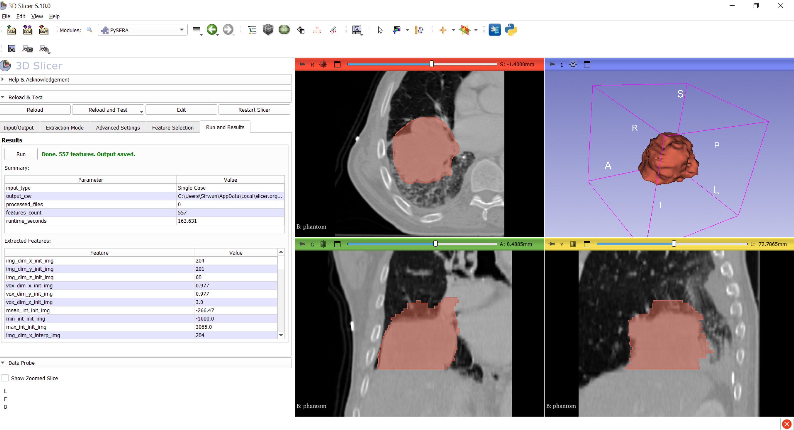

# SlicerPySERA — PySERA Radiomics Extension for 3D Slicer

[](https://github.com/topics/3d-slicer-extension)
[](https://www.python.org/downloads/)
[](LICENSE)
[](#version-history)

**SlicerPySERA** integrates the [**PySERA**](https://github.com/radiuma-com/PySERA) radiomics engine into **3D Slicer** as an interactive extension.  
It enables **reproducible radiomics extraction** inside Slicer, supporting both **IBSI-aligned handcrafted radiomics** and **deep feature extraction**.

---

## Table of Contents

1. [Overview](#overview)
2. [Key Features](#key-features)
3. [Screenshots](#screenshots)
4. [Installation](#installation)
5. [Quick Start](#quick-start)
6. [Inputs and Supported Data](#inputs-and-supported-data)
7. [Batch Processing Folder Structure](#batch-processing-folder-structure)
8. [Configuration and Parameters](#configuration-and-parameters)
9. [Outputs](#outputs)
10. [Troubleshooting](#troubleshooting)
11. [Citation](#citation)
12. [License](#license)
13. [Support](#support)
14. [Acknowledgment](#acknowledgment)
15. [For Developers](#for-developers)

---

## Overview

SlicerPySERA provides a graphical user interface (GUI) for configuring and running radiomics pipelines on medical images and segmentations (masks) within **3D Slicer**.

It leverages the [PySERA](https://github.com/radiuma-com/PySERA) library for computation to produce standardized radiomics outputs.  
The goal is to make radiomics extraction easier to run, easier to reproduce, and consistent across datasets and users.

Typical use cases include:

- Feature extraction from ROIs for radiomics modeling
- Dataset-wide batch feature extraction for research workflows
- Comparing handcrafted radiomics vs deep features for downstream tasks

---

## Key Features

- **Integrated into 3D Slicer**: no external scripting required for typical use
- **Handcrafted (IBSI-aligned) radiomics**: intensity, shape, texture families (depending on PySERA configuration)
- **Deep feature extraction**: optional CNN-based deep features with selectable backbones
- **Single-case and batch workflows**:
  - Single: one image + one mask
  - Batch: folders containing multiple cases
- **Clear results display**:
  - In-Slicer “Summary”
  - In-Slicer “Extracted Features” table (**Feature | Value**)
- **Reproducibility**:
  - Outputs saved on disk
  - Parameters taken from bundled configuration files and user UI selections

---

## Screenshots

All screenshots are stored in `PySERA/Resources/Screenshots/`.

> If you are viewing the README on GitHub, the images below are loaded using repository-relative paths.  
> If images do not render, confirm the filenames match the repository exactly.

### Module Overview


### Input / Output Tab


### Handcrafted Radiomics Mode


### Deep Feature Mode


### Advanced Settings


### Feature Subset Selection


### Run & Results


---

## Installation

### Option 1 — Install from the 3D Slicer Extension Manager (recommended)

1. Open **3D Slicer**
2. Go to **Extensions Manager**
3. Search for **PySERA**
4. Install and restart Slicer

### Option 2 — Install from source (for development)

See [For Developers](#for-developers).

---

## Quick Start

1. Open **3D Slicer**
2. Load:
   - an **image** (e.g., NIfTI/NRRD/DICOM series)
   - a **segmentation** (mask)
3. Open the module:
   - **Modules → Analysis → PySERA** (category may vary)
4. In **Input/Output**:
   - choose **Single Case** or **Batch (Folders)**
   - set an **Output Folder** (must be writable)
5. Choose **Extraction Mode**:
   - **Handcrafted Radiomics** or **Deep Features**
6. (Optional) adjust settings and feature selection
7. Click **Run**  in section **Run and Results**

After completion:
- “Summary” is populated
- “Extracted Features” shows **Feature | Value**
- A CSV output is saved to the selected output folder

---

## Inputs and Supported Data

The module supports running PySERA on common medical imaging data formats that are supported by the underlying Slicer + PySERA pipeline.  
Typical inputs include:

- **NIfTI** (`.nii`, `.nii.gz`)
- **NRRD** (`.nrrd`)
- **DICOM** (as loaded in Slicer)
- **RTSTRUCT** (if supported by the workflow used in your pipeline)

> Actual support depends on your installed Slicer readers and PySERA processing pipeline.

### Single Case Mode (Image + Mask)

Use this mode when you have one image file and a corresponding mask file.

**You select:**
- Image file
- Mask file
- Output folder

### Batch Mode (Folders)

Use this mode when you have multiple cases stored in two folders:
- one folder for images
- one folder for masks

**You select:**
- Image folder
- Mask folder
- Output folder

The folder structures must match. See the next section.

---

## Batch Processing Folder Structure

In batch mode, the **image folder and mask folder must be mirrored**.  
That means for every image file under the Images folder, there must be a corresponding mask file at the **same relative path** under the Masks folder.

### Example A — Flat structure (recommended)
**Correct:**
```
Images/
  case01.nii.gz
  case02.nii.gz

Masks/
  case01.nii.gz
  case02.nii.gz
```

### Example B — Nested structure (also valid)
**Correct:**
```
Images/
  patientA/
    scan.nii.gz
  patientB/
    scan.nii.gz

Masks/
  patientA/
    scan.nii.gz
  patientB/
    scan.nii.gz
```

### Example C — Extra nesting in one side (not valid)
**Incorrect:**
```
Images/
  patientA/
    scan.nii.gz

Masks/
  patientA/
    masks/
      scan.nii.gz
```

**Recommendation:** keep the structure simple (Example A) unless you have a strong reason to nest.

---

## Configuration and Parameters

SlicerPySERA reads default configuration from the bundled parameter files:

- `PySERA/parameters.yaml`
- `PySERA/parameters.json`

The GUI exposes key settings and passes them to PySERA at runtime.

---

### Common Parameters (both modes)

| Parameter | Meaning |
|---|---|
| `num_workers` | Number of workers, or `auto` |
| `enable_parallelism` | Enables parallel processing (if supported) |
| `apply_preprocessing` | Apply preprocessing when enabled |
| `min_roi_volume` | Minimum ROI volume threshold |
| `roi_selection_mode` | ROI grouping mode (`per_Img` or `per_region`) |
| `aggregation_lesion` | Aggregate multi-lesion features (if used) |
| `report` | Logging verbosity (`all`, `info`, `warning`, `error`, `none`) |

---

### Handcrafted Radiomics Mode

Handcrafted mode exposes IBSI-style parameters such as discretization, interpolation, resampling, and intensity handling.  
The exact feature families and interpretation follow the PySERA configuration.


| Category | Parameter | Description |
|---|---|---|
| Data Type | `radiomics_DiscType`, `bin_size` | Imaging modality (“CT”, “MR”, “PET”, “OTHER”) |
| Discretization | `radiomics_DiscType` | Enables parallel processing (if supported) |
| Resampling | `radiomics_isScale`, `radiomics_VoxInterp`, `radiomics_ROIInterp`, `radiomics_isotVoxSize`, `radiomics_isotVoxSize2D`, `radiomics_isIsot2D` | Voxel scaling, interpolation, isotropic resampling |
| Intensity Handling | `radiomics_isGLround`, `radiomics_isReSegRng`, `radiomics_ReSegIntrvl01`, `radiomics_ReSegIntrvl02`, `radiomics_isOutliers`, `radiomics_isQuntzStat`, `radiomics_ROI_PV` | Rounding, re-segmentation range, and partial-volume control |
| IVH Parameters | `radiomics_IVH_Type`, `radiomics_IVH_DiscCont`, `radiomics_IVH_binSize` | Controls Intensity-Volume Histogram discretization |
| Feature Precision | `feature_value_mode` | “REAL_VALUE” or “APPROXIMATE_VALUE” for NaN handling |

---

### Deep Feature Mode

Deep feature mode enables CNN-based feature extraction using a selected backbone model.

| Parameter | Description |
|---|---|
| `extraction_mode` | Set to "deep_feature" to enable deep CNN feature extraction |
| `deep_learning_model` | Deep model backbone (`resnet50`, `vgg16`, `densenet121`) |
| Note | IBSI parameters are ignored when using deep feature extraction mode. |

**Important note:**
- When deep feature mode is enabled, handcrafted (IBSI) parameters may be ignored by the deep pipeline.

---

## Outputs

SlicerPySERA writes results to the selected output folder.

### Primary output
- **CSV file** containing extracted features

### In-Slicer outputs
- **Summary** table (inputs, output path, number of features, runtime)
- **Extracted Features** table:
  - Exactly two columns: **Feature | Value**
  - Read-only

---

## Troubleshooting

### No output file created
- Ensure the selected **Output Folder** is writable (avoid protected system folders).
- Confirm you have permission to write files in that location.

### Batch mode does not match image and mask
- Verify **mirrored structure** between image and mask folders.
- Ensure filenames match and there is no extra nesting.
- Test with the “Flat structure” example to validate your setup.

### PySERA dependency install issues
- The extension installs required Python packages into Slicer’s Python environment when needed.
- If installation is blocked (proxy/firewall), install dependencies manually in Slicer’s Python environment.

### Results appear but “Extracted Features” is empty
- Check the run summary output path and confirm the CSV exists.
- Increase logging level (e.g., `report=all`) and re-run to inspect details.

### Behavior During Intensive Processing
During feature extraction with the PySERA extension in 3D Slicer, the application may temporarily become unresponsive due to heavy computational processing. This is normal behavior and not a software issue. Processing time depends on the selected feature category and data dimensionality. Please wait until the operation completes.

---

## Contact

For general inquiries or academic collaboration:

**Dr. Mohammad R. Salmanpour (Team Lead)**  
📧 msalman@bccrc.ca · m.salmanpoor66@gmail.com · m.salmanpour@ubc.ca  

## Authors

- **Dr. Mohammad R. Salmanpour** (Team Lead, Fund Provider, Evaluator, Medical Imaging Expert, Backend, Refactoring, Debugging, Library Management, IBSI Standardization, Slicer GUI)  
- **Sirwan Barichin** (IBSI Standardization, Backend, Refactoring, Debugging, Library Management, Activation of PySERA Library, Slicer GUI) 
- **Dr. Mehrdad Oveisi** (Evaluator, Software Engineer, Advisor) 
- **Dr. Arman Rahmim** (Fund Provider, Medical Imaging Expert, Evaluator, Advisor)

## Citation

If you use this extension or PySERA in your research, please cite:

```bibtex
@misc{salmanpour2025pyseraopensourcestandardizedpython,
      title={PySERA: Open-Source Standardized Python Library for Automated, Scalable, and Reproducible Handcrafted and Deep Radiomics},
      author={Mohammad R. Salmanpour and Amir Hossein Pouria and Sirwan Barichin and Yasaman Salehi and Sonya Falahati and Isaac Shiri and Mehrdad Oveisi and Arman Rahmim},
      year={2025},
      eprint={2511.15963},
      archivePrefix={arXiv},
      primaryClass={physics.med-ph},
      url={https://arxiv.org/abs/2511.15963}
}
```

---

## License

Released under the **MIT License**.  
See [LICENSE](LICENSE) for details.

---

## Support

- Issues / bug reports: https://github.com/radiuma-com/SlicerPySERA/issues
- PySERA core library: https://github.com/radiuma-com/PySERA

---

## Acknowledgment

Supported by:
- **[Quantitative Radiomolecular Imaging and Therapy (Qurit) Lab](https://www.qurit.ca/)**, UBC, BC, Canada  
- **[BC Cancer Research Institute](https://www.bccrc.ca/)**, Vancouver, BC, Canada  
- **[Virtual Collaboration (VirCollab) Group](https://vircollab.com/)**, BC, Canada  
- **[Technological Virtual Collaboration Corporation (TECVICO Corp.)](https://www.tecvico.com/)**, Bc, Canada 

Funding provided by the Natural Sciences and Engineering Research Council of Canada (NSERC) —  
Idea to Innovation (I2I) Grant GR034192.

---

## For Developers

This section is intended for developers who want to build, test, or contribute to the extension.

### Repository Structure

### Development Install (local testing)

1. In 3D Slicer, go to:  
   **Edit → Application Settings → Modules → Additional Module Paths**
2. Add the path to the `SlicerPySERA/PySERA/` folder
3. Restart Slicer

### Notes on dependencies

The extension uses the PySERA Python package.  
The [**PySERA**](https://github.com/radiuma-com/PySERA) core library is maintained separately for standalone Python usage.

---

