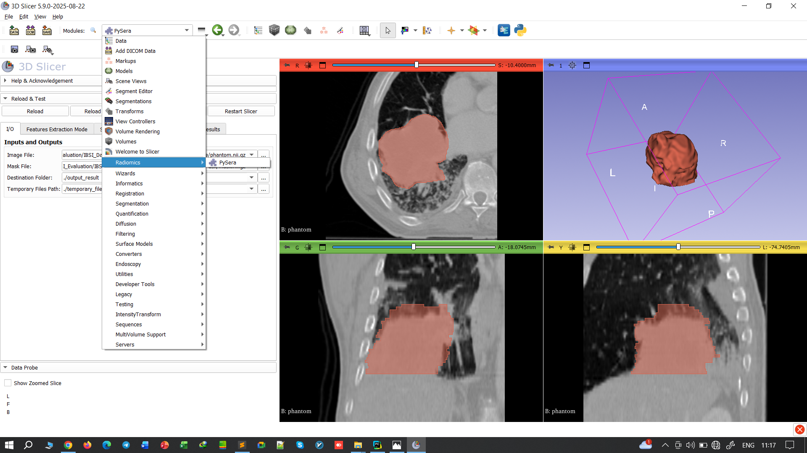
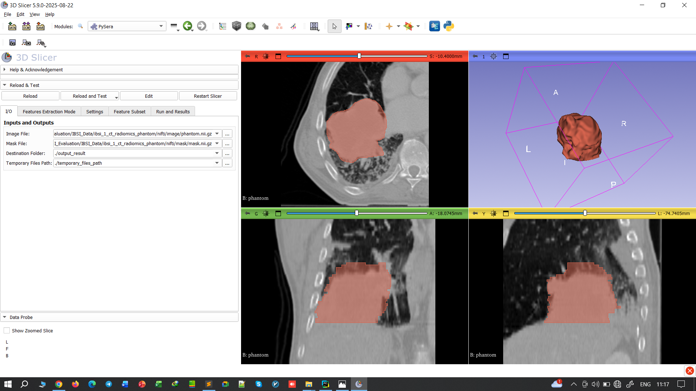
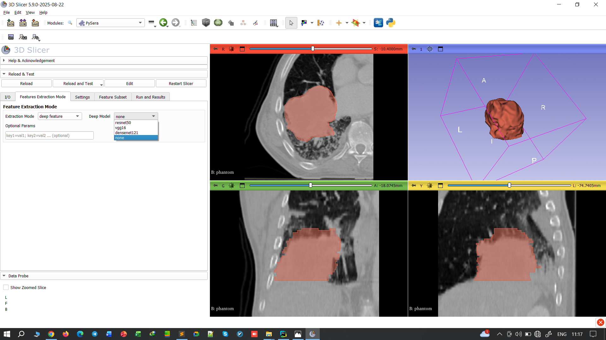

# SlicerPySERA — PySERA Radiomics Extension for 3D Slicer

[](https://github.com/topics/3d-slicer-extension)
[](https://www.python.org/downloads/)
[](LICENSE)
[](#version-history)

**SlicerPySERA** integrates the [**PySERA**](https://github.com/radiuma-com/PySERA) radiomics engine into **3D Slicer** as an interactive extension.  
It enables reproducible, IBSI-compliant handcrafted radiomics as well as deep feature extraction directly within the Slicer environment.

---

## Table of Contents
1. [Overview](#overview)  
2. [Repository Structure](#repository-structure)  
3. [Key Features](#key-features)  
4. [Screenshots](#screenshots)  
5. [Installation](#installation)  
6. [Usage in 3D Slicer](#usage-in-3d-slicer)  
7. [Data & Batch Expectations](#data--batch-expectations)  
8. [Parameters](#parameters-selected)  
9. [Output](#output)  
10. [Troubleshooting](#troubleshooting)  
11. [Integration Notes](#integration-notes)  
12. [Version History](#version-history)  
13. [Contact](#contact)  
14. [Maintenance](#maintenance)  
15. [Authors](#authors)  
16. [Citation](#citation)  
17. [License](#license)  
18. [Support](#support)  
19. [Acknowledgment](#acknowledgment)

---

## Overview

SlicerPySERA provides a graphical interface for configuring and running radiomics pipelines on medical images and segmentations within **3D Slicer**. It exposes all relevant IBSI (Image Biomarker Standardisation Initiative)-aligned preprocessing and feature extraction settings directly through the GUI.

It leverages the [PySERA library](https://github.com/radiuma-com/PySERA) for computation, ensuring standardized, reproducible, and validated radiomics results.

**Key capabilities:**
- IBSI-compliant handcrafted radiomics and deep features  
- Multi-format compatibility (NIfTI, DICOM, NRRD, RTSTRUCT, etc.)  
- Batch and parallel processing support  
- Comprehensive logs and parameter export for reproducibility  

---

## Repository Structure

- **pysera/** – The main PySERA library for radiomics computations, usable independently of Slicer.  
- **PySera/** – The main 3D Slicer module, including ScriptedLoadableModule, UI code, and integration with `pysera`.  
- **PySeraCLI/** – Optional command-line interface for headless use.  
- **PySeraQt/** – Optional standalone Qt-based GUI.  
- **Data/** – Example datasets for testing and development purposes.  
- **Resources/** – All non-code assets, including GUI icons, screenshots, configuration files, and templates for reports.  

---

## Key Features

- **Fully integrated with 3D Slicer** – no external scripts required  
- **IBSI-compliant handcrafted features** (morphological, texture, statistical, etc.)  
- **Deep-learning feature extraction** with pretrained models (ResNet50, VGG16, DenseNet121)  
- **Advanced configurability** – bin size, discretization, resampling, intensity rounding  
- **High reproducibility** – parameter snapshot and structured report export  

---

## Screenshots

The following screenshots illustrate the **main workflows and tabs** of the SlicerPySERA module.  
All images are located in `Resources/Screenshots/`.

<div align="center">
  <h3>Title & Feature Categories</h3>
  
</div>

<div align="center">
  <h3>Input / Output Settings</h3>
  
</div>

<div align="center">
  <h3>Handcrafted Feature Extraction Mode</h3>
  
</div>

<div align="center">
  <h3>Deep Feature Extraction Mode</h3>
  
</div>

<div align="center">
  <h3>Setting Parameters</h3>
  
</div>

<div align="center">
  <h3>Feature Subset Selection</h3>
  
</div>

<div align="center">
  <h3>Run & Show Results</h3>
  
</div>

---

## Installation

### Option 1 — Scripted Module (recommended)

1. Clone or download this repository.  
2. In 3D Slicer, navigate to:  
   **Edit → Application Settings → Modules → Additional Module Paths**  
   Add the path to the `PySera/` directory, then restart Slicer.  
3. Ensure `pysera` is available to Slicer’s Python:  
   - Simplest: copy `pysera/` into `PySera/lib/pysera/`  
   - Alternatively: install `pysera` into Slicer’s Python interpreter.  
4. After restarting, **PySERA** appears under the *Radiomics* module category.

> **Note:** The [PySERA library](https://github.com/radiuma-com/PySERA) can also be used independently in Python.

---

## Usage in 3D Slicer

1. Load an image and segmentation (mask) into Slicer.  
2. Open **Modules → Radiomics → PySERA**.  
3. Select image and mask inputs, and specify output directories.  
4. Choose **Handcrafted** or **Deep** feature extraction mode.  
5. Adjust **IBSI parameters** (for handcrafted mode).  
6. Select categories/dimensions for feature subsets.  
7. Click **Apply** to start feature extraction.

---

## Data & Batch Expectations

- Compatible with **NIfTI**, **NRRD**, **DICOM**, and **RTSTRUCT** inputs.  
- Ensure image/mask folder structures are **mirrored** and contain no extra nesting.  
- RTSTRUCT processing uses a temporary cache folder (`temporary_files_path`).  

---

## Parameters (selected)

### Common (both modes)

<table border="1" cellpadding="8" cellspacing="0" style="border-collapse: collapse; text-align: center; margin-left: auto; margin-right: auto;">
  <tr>
    <th>Parameter</th>
    <th>Description</th>
  </tr>
  <tr><td>`num_workers`</td><td>Number of CPU cores or “auto” for automatic selection</td></tr>
  <tr><td>`enable_parallelism`</td><td>Enables multiprocessing if supported</td></tr>
  <tr><td>`apply_preprocessing`</td><td>Apply IBSI-aligned ROI preprocessing</td></tr>
  <tr><td>`min_roi_volume`</td><td>Minimum ROI volume threshold (mm³)</td></tr>
  <tr><td>`roi_selection_mode`</td><td>“per_Img” or “per_region” for ROI grouping</td></tr>
  <tr><td>`roi_num`</td><td>Number of ROIs to process</td></tr>
  <tr><td>`aggregation_lesion`</td><td>Enable multi-lesion feature aggregation</td></tr>
  <tr><td>`report`</td><td>Logging level: “all”, “info”, “warning”, “error”, “none”</td></tr>
  <tr><td>`temporary_files_path`</td><td>Directory for temporary cache files</td></tr>
</table>

---

### Handcrafted only (IBSI-related)

<table border="1" cellpadding="8" cellspacing="0" style="border-collapse: collapse; text-align: center; margin-left: auto; margin-right: auto;">
  <tr>
    <th>Category</th>
    <th>Parameter</th>
    <th>Description</th>
  </tr>
  <tr><td>Data Type</td><td>`radiomics_DataType`</td><td>Imaging modality (“CT”, “MR”, “PET”, “OTHER”)</td></tr>
  <tr><td>Discretization</td><td>`radiomics_DiscType`, `bin_size`</td><td>Quantization type (“FBS”/“FBN”) and bin width</td></tr>
  <tr><td>Resampling</td><td>`radiomics_isScale`, `radiomics_VoxInterp`, `radiomics_ROIInterp`, `radiomics_isotVoxSize`, `radiomics_isotVoxSize2D`, `radiomics_isIsot2D`</td><td>Voxel scaling, interpolation, isotropic resampling</td></tr>
  <tr><td>Intensity Handling</td><td>`radiomics_isGLround`, `radiomics_isReSegRng`, `radiomics_ReSegIntrvl01`, `radiomics_ReSegIntrvl02`, `radiomics_isOutliers`, `radiomics_isQuntzStat`, `radiomics_ROI_PV`</td><td>Rounding, re-segmentation range, and partial-volume control</td></tr>
  <tr><td>IVH Parameters</td><td>`radiomics_IVH_Type`, `radiomics_IVH_DiscCont`, `radiomics_IVH_binSize`</td><td>Controls Intensity-Volume Histogram discretization</td></tr>
  <tr><td>Feature Precision</td><td>`feature_value_mode`</td><td>“REAL_VALUE” or “APPROXIMATE_VALUE” for NaN handling</td></tr>
</table>

---

### Deep Feature Mode

<table border="1" cellpadding="8" cellspacing="0" style="border-collapse: collapse; text-align: center; margin-left: auto; margin-right: auto;">
  <tr>
    <th>Parameter</th>
    <th>Description</th>
  </tr>
  <tr><td>`extraction_mode`</td><td>Set to "deep_feature" to enable deep CNN feature extraction</td></tr>
  <tr><td>`deep_learning_model`</td><td>Deep model backbone (`resnet50`, `vgg16`, `densenet121`)</td></tr>
  <tr><td>Note</td><td>IBSI parameters are ignored when using deep feature extraction mode.</td></tr>
</table>

---

## Output

- **Excel Report** with:
  - `Radiomics_Features`: All extracted features  
  - `Parameters`: Run configuration  
  - `Report`: Warnings or extraction issues  
- **In-Slicer summary log** after each run.

---

## Troubleshooting

| Issue | Resolution |
|--------|-------------|
| No visible effect of report level | Ensure report level is set *before* pressing “Apply”. |
| `'str' object is not callable` error | Occurs due to Qt bindings; fixed internally via safe access. |
| Missing output | Verify mirrored image/mask structure and writable destination folder. |
| DICOM RTSTRUCT memory errors | Confirm `temporary_files_path` is on a writable drive. |

---

## Integration Notes

- Implemented as a **ScriptedLoadableModule** using Qt/CTK.  
- Parameters are grouped for **Handcrafted** and **Deep** extraction modes.  
- Synchronization maintained between selected categories and dimensions.

---

## Version History

```
v1
└─ v1.0
   └─ v1.0.0 — Initial stable release
```

---

## Contact

For general inquiries or academic collaboration:

**Dr. Mohammad R. Salmanpour (Team Lead)**  
📧 msalman@bccrc.ca · m.salmanpoor66@gmail.com · m.salmanpour@ubc.ca  

---

## Maintenance

For technical support and maintenance inquiries:

**Dr. Mohammad R. Salmanpour (Team Lead)**  
msalman@bccrc.ca · m.salmanpoor66@gmail.com · m.salmanpour@ubc.ca

**Sirwan Barichin**  
sirwanbarichin@gmail.com

---

## Authors

- **Dr. Mohammad R. Salmanpour** (Team Lead, Fund Provider, Evaluator, Medical Imaging Expert, Backend, Refactoring, Debugging, Library Management, IBSI Standardization, Slicer GUI) – msalman@bccrc.ca, m.salmanpoor66@gmail.com, m.salmanpour@ubc.ca  
- **Sirwan Barichin** (IBSI Standardization, Debugging, Activation of PySERA Library, Slicer GUI) – sirwanbarichin@gmail.com  
- **Dr. Mehrdad Oveisi** (Evaluator, Software Engineer, Advisor) – moveisi@cs.ubc.ca  
- **Dr. Arman Rahmim** (Fund Provider, Medical Imaging Expert, Evaluator, Advisor) – arman.rahmim@ubc.ca, arahmm@bccrc.ca

---

## Citation

If you use this extension or PySERA in your research, please cite both:

```bibtex
@software{slicerpysera2025,
  title     = {SlicerPySERA: A 3D Slicer Extension for IBSI-Compliant Radiomics via PySERA},
  author    = {SlicerPySERA Team},
  year      = {2025},
  url       = {https://github.com/MohammadRSalmanpour/SlicerPySERA}
}

@software{pysera2025,
  title     = {PySERA: A Simple Python Library for Radiomics Feature Extraction},
  author    = {PySERA Team},
  year      = {2025},
  url       = {https://github.com/MohammadRSalmanpour/PySERA}
}
```

---

## License

Released under the **MIT License**.  
See [LICENSE](LICENSE) for details.

---

## Support

- Issues: [GitHub Issues](https://github.com/radiuma-com/SlicerPySERA/issues)  
- Documentation: This README and module help  
- Examples: See [PySERA Examples](https://github.com/radiuma-com/PySERA/tree/main/examples)

---

## Acknowledgment

Supported by:
- **[Quantitative Radiomolecular Imaging and Therapy (Qurit) Lab](https://www.qurit.ca/)**, UBC, Canada  
- **[BC Cancer Research Institute](https://www.bccrc.ca/)**, Vancouver, Canada  
- **[Virtual Collaboration (VirCollab) Group](https://www.vircollab.com/)**, Canada  
- **[Technological Virtual Collaboration Corporation (TECVICO Corp.)](https://www.tecvico.com/)**, Canada  

Funding provided by the **Natural Sciences and Engineering Research Council of Canada (NSERC)** —  
*Idea to Innovation (I2I) Grant GR034192.*

---

*This repository provides the **SlicerPySERA** extension for 3D Slicer.*  
The [**PySERA core library**](https://github.com/radiuma-com/PySERA) is maintained separately for standalone Python usage.


