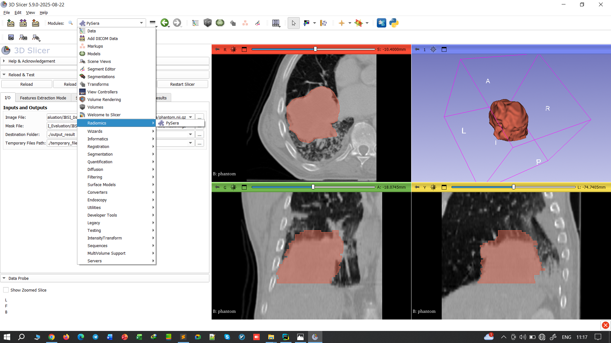
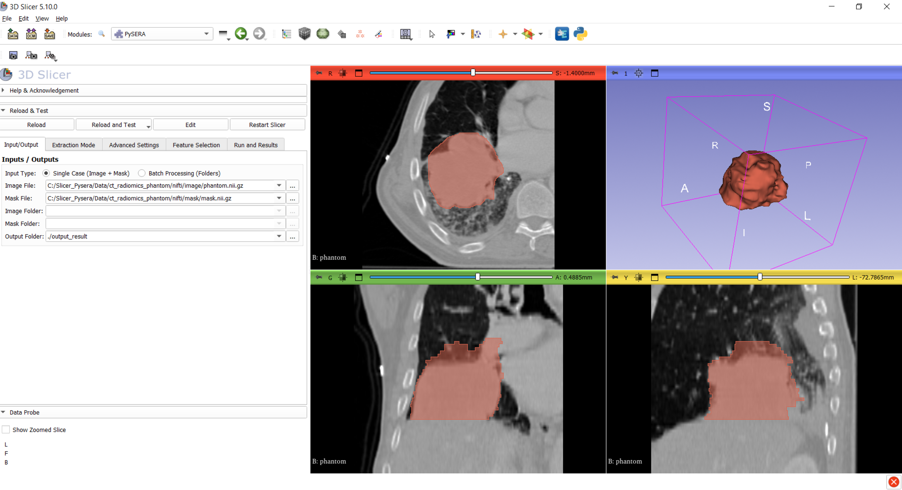
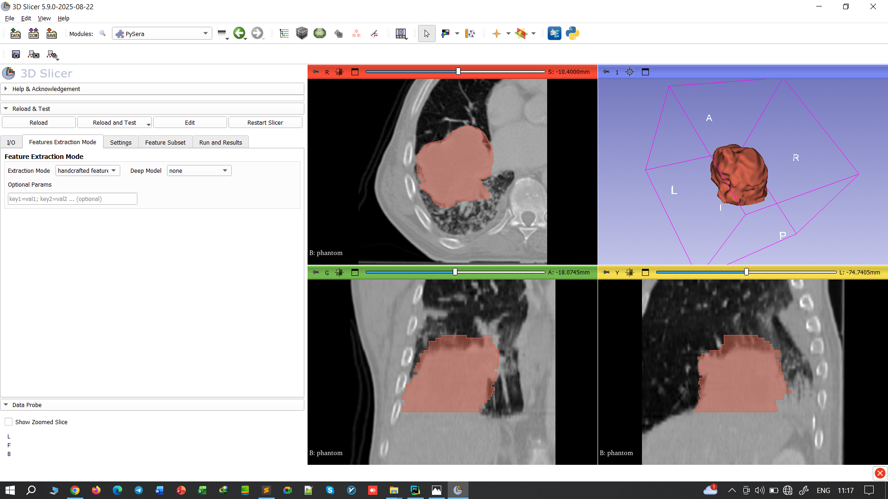
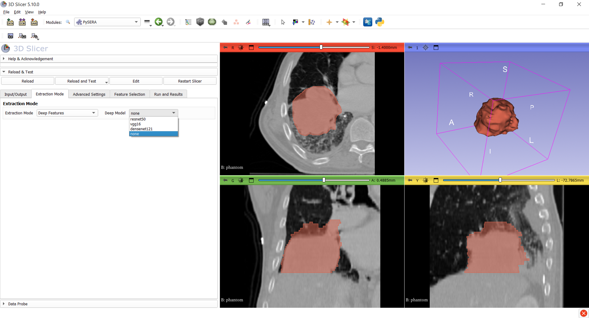
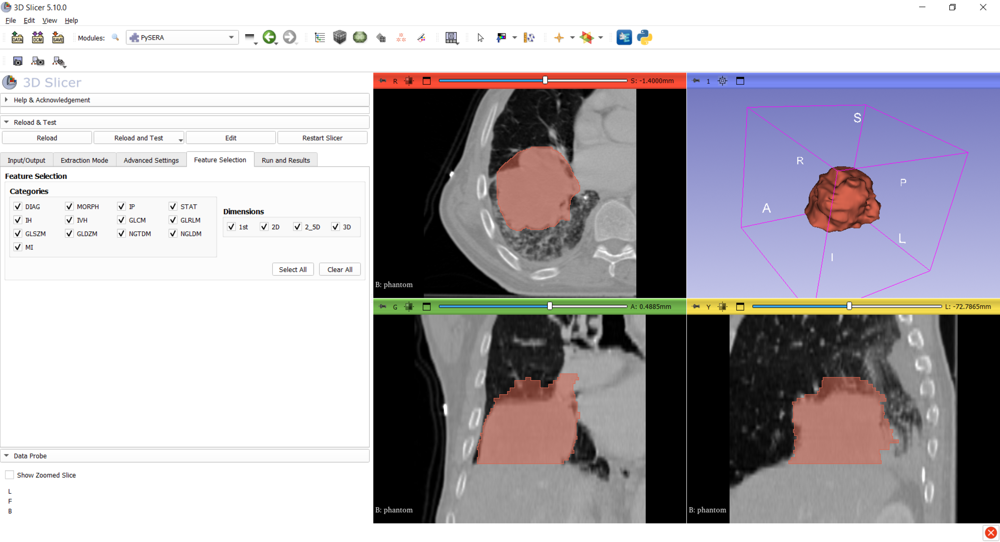
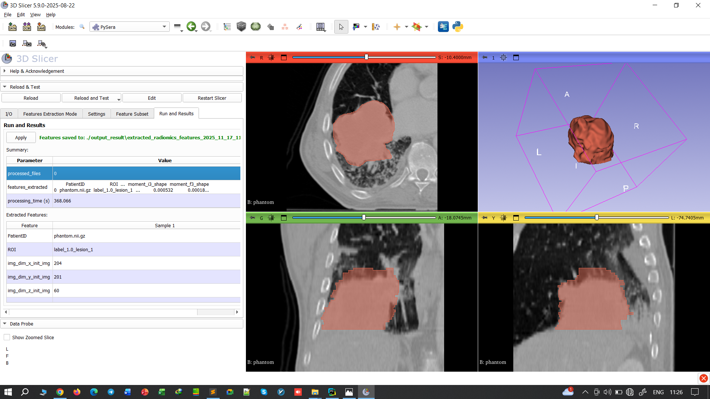

# SlicerPySERA — PySERA Radiomics Extension for 3D Slicer

[](https://github.com/topics/3d-slicer-extension)
[](https://www.slicer.org/)
[](https://www.python.org/downloads/)
[](LICENSE)
[](#versioning-and-release-notes)

**SlicerPySERA** integrates the **[PySERA](https://github.com/radiuma-com/PySERA)** radiomics engine into **3D Slicer** as an interactive extension.
It provides a practical, UI-driven workflow for **reproducible radiomics extraction** inside Slicer, supporting both:

- **Handcrafted radiomics** (IBSI-aligned feature families when configured in PySERA)
- **Deep feature extraction** (CNN-based embeddings through PySERA’s deep pipeline)

This repository is designed to support *research-grade* feature extraction workflows in Slicer while keeping the user experience simple enough for everyday use.

---

## Table of Contents

1. [What This Extension Is (and Isn’t)](#what-this-extension-is-and-isnt)
2. [Overview](#overview)
3. [Key Features](#key-features)
4. [Feature Families and Dimensions](#feature-families-and-dimensions)
5. [Screenshots](#screenshots)
6. [Installation](#installation)
   - [Option 1 — Install via the Extension Manager](#option-1--install-via-the-extension-manager-recommended)
   - [Option 2 — Install from Source (Developer Mode)](#option-2--install-from-source-developer-mode)
   - [Offline / Restricted Network Environments](#offline--restricted-network-environments)
7. [Quick Start](#quick-start)
8. [Inputs and Supported Data](#inputs-and-supported-data)
9. [Batch Processing](#batch-processing)
   - [Folder Mirroring Rules](#folder-mirroring-rules)
   - [Recommended Naming Conventions](#recommended-naming-conventions)
10. [Configuration and Parameters](#configuration-and-parameters)
    - [Where Parameters Live](#where-parameters-live)
    - [Common Parameters](#common-parameters)
    - [Handcrafted Mode Parameters](#handcrafted-mode-parameters)
    - [Deep Feature Mode Parameters](#deep-feature-mode-parameters)
    - [Logging and Reproducibility Metadata](#logging-and-reproducibility-metadata)
11. [Outputs](#outputs)
12. [Reproducibility Checklist](#reproducibility-checklist)
13. [Performance Notes](#performance-notes)
14. [Troubleshooting and FAQ](#troubleshooting-and-faq)
15. [Data Privacy and Security Notes](#data-privacy-and-security-notes)
16. [Citation](#citation)
17. [License](#license)
18. [Support and Contact](#support-and-contact)
19. [Acknowledgments](#acknowledgments)
20. [For Developers](#for-developers)
    - [Repository Structure](#repository-structure)
    - [Build & Packaging Notes (CMake / CI)](#build--packaging-notes-cmake--ci)
    - [Development Install (Local Testing)](#development-install-local-testing)
    - [Registering the Extension for Slicer 5.10+](#registering-the-extension-for-slicer-510)
    - [Contributing](#contributing)
    - [Versioning and Release Notes](#versioning-and-release-notes)

---

## What This Extension Is (and Isn’t)

**SlicerPySERA is a Slicer-facing UI and workflow layer** around the PySERA computation engine.
The extension’s job is to:

- Collect inputs (image + mask / segmentation)
- Collect configuration options (UI + parameter files)
- Run PySERA reliably (single-case or batch)
- Save outputs to disk and display them in Slicer tables

It is **not** intended to replace the PySERA Python library for scripting-heavy or HPC pipelines.  
If you already run PySERA in a Python environment (e.g., notebooks, Snakemake, SLURM), that is still the best route for large-scale experiments.
This extension is for situations where you want a **transparent, interactive, Slicer-native** workflow.

---

## Overview

SlicerPySERA provides a graphical user interface (GUI) for configuring and running radiomics pipelines on medical images and segmentations (masks) within **3D Slicer**.

It leverages the **PySERA** library to compute standardized radiomics outputs and aims to make feature extraction:

- **Easier to run** (no scripting required for typical use)
- **Easier to reproduce** (parameters are visible and saved)
- **Consistent across datasets and users** (a single pipeline definition)

Typical use cases include:

- Feature extraction from ROIs for radiomics modeling
- Dataset-wide batch extraction for research workflows
- Comparing handcrafted radiomics vs deep features for downstream tasks

---

## Key Features

### User-facing workflow

- **Integrated into 3D Slicer**: use the module like any other Slicer tool.
- **Two input workflows**:
  - **Single case**: one image + one mask
  - **Batch**: two folders (images + masks) with mirrored structure
- **Two extraction modes**:
  - **Handcrafted radiomics** (IBSI-aligned feature families when enabled in PySERA)
  - **Deep features** (CNN-based representation)
- **Clear results display**:
  - “Summary” panel for run information and paths
  - “Extracted Features” table with exactly **two columns**: **Feature | Value**
- **Disk outputs**:
  - Timestamped CSV files
  - Consistent naming conventions for batch runs
- **Parameter-driven**:
  - Defaults and UI hints come from bundled configuration files

### Engineering choices that matter for Slicer extensions

- **Packaging-safe scripting**:
  - Avoid importing pip-installed packages at module import time.
  - Install/import runtime dependencies in the module logic only.
- **Extension indexing compatibility**:
  - Uses standard CMake patterns and avoids absolute resource paths (important for CI packaging).

---

## Feature Families and Dimensions

SlicerPySERA exposes feature *families* (“categories”) and *dimensionality modes* (“dimensions”) using a clear UI selection model.

### Categories (feature families)

The selection panel supports the following families:

- `DIAG`, `MORPH`, `IP`, `STAT`, `IH`, `IVH`,
- `GLCM`, `GLRLM`, `GLSZM`, `GLDZM`, `NGTDM`, `NGLDM`,
- `MI`

In the UI you can either select a subset or simply keep **all** enabled.

### Dimensions

The dimension panel supports:

- `1st`, `2D`, `2_5D`, `3D`

A convenience behavior is implemented: changing the selected dimensions can automatically constrain the compatible category families.

> Note: the exact feature definitions and what is computed for a given mode ultimately depends on PySERA and your configuration.

---

## Screenshots

All screenshots are stored in `Resources/Screenshots/`.

> GitHub renders these using repository-relative paths.  
> If images do not render, verify the filenames and paths match the repository exactly (case-sensitive on Linux).

### Module Overview


### Input / Output Tab


### Handcrafted Radiomics Mode


### Deep Feature Mode


### Advanced Settings


### Feature Subset Selection


### Run & Results


---

## Installation

### Option 1 — Install via the Extension Manager (recommended)

1. Open **3D Slicer**
2. Go to **Extensions Manager**
3. Search for **PySERA** / **SlicerPySERA** (name depends on the extension catalog entry)
4. Install and restart Slicer

After installation, the module should appear under:

**Modules → Analysis → PySERA**  
(category may vary depending on the extension catalog entry)

> If the extension is not available in your Slicer build yet, see
> [Registering the Extension for Slicer 5.10+](#registering-the-extension-for-slicer-510).

---

### Option 2 — Install from Source (Developer Mode)

This option is recommended for:

- local development
- testing changes before submitting a PR
- running the latest `main` branch version

A quick approach is to add the module path in Slicer:

1. Open **3D Slicer**
2. Go to **Edit → Application Settings → Modules**
3. Under **Additional module paths**, add the path to the module directory:

   - `.../SlicerPySERA/`

4. Restart Slicer

See [Development Install (Local Testing)](#development-install-local-testing) for more details and tips.

---

### Offline / Restricted Network Environments

SlicerPySERA can auto-install Python dependencies using `slicer.util.pip_install()` at runtime.

If you are behind a proxy, on a restricted network, or offline:

- You may need to **preinstall Python packages into Slicer’s Python environment**.
- This is most relevant for:
  - `pysera` (required)
  - `PyYAML` (optional but recommended; see parameter file notes below)
  - deep learning dependencies used by PySERA (if you enable deep features)

A practical workflow is:

1. Download wheels (`.whl`) for required packages on a machine with internet
2. Transfer them to the offline machine
3. Install them from the Slicer Python console using `slicer.util.pip_install(<path_to_wheel>)`

---

## Quick Start

1. Open **3D Slicer**
2. Load:
   - an **image** (e.g., NIfTI/NRRD/DICOM series)
   - a **segmentation / mask** (ROI)
3. Open the module:
   - **Modules → Analysis → PySERA**
4. Go to **Input/Output**
   - Choose **Single Case** or **Batch (Folders)**
   - Set an **Output Folder** (must be writable)
5. Choose **Extraction Mode**
   - **Handcrafted Radiomics** or **Deep Features**
6. (Optional) adjust **Advanced Settings** and **Feature Selection**
7. Click **Run** in **Run and Results**

After completion:

- “Summary” is populated (inputs, outputs, runtime)
- “Extracted Features” table is filled (Feature | Value)
- A CSV output is saved to the selected output folder

---

## Inputs and Supported Data

SlicerPySERA expects **an image** and **a mask / segmentation** that define the region of interest (ROI).

### Supported imaging formats (typical)

The module is designed around formats commonly supported by Slicer and PySERA workflows:

- **NIfTI** (`.nii`, `.nii.gz`)
- **NRRD** (`.nrrd`)
- **DICOM** (as loaded in Slicer)
- other formats supported by Slicer I/O and your pipeline

> Practical note: In many research workflows, exporting images/masks to NIfTI before running radiomics is the simplest and most reproducible approach.

### Single Case Mode (Image + Mask)

Use this mode when you have one image and one corresponding ROI mask.

You provide:

- Image file
- Mask file
- Output folder

### Batch Mode (Folders)

Use this mode when you have many cases stored under two directories:

- image folder
- mask folder

You provide:

- Image folder
- Mask folder
- Output folder

See [Batch Processing](#batch-processing) for folder-mirroring rules.

---

## Batch Processing

### Folder Mirroring Rules

In batch mode, the **image folder and mask folder must be mirrored**.

This means: for every image file under the *Images* folder, there must be a corresponding mask file at the **same relative path** under the *Masks* folder.

#### Example A — Flat structure (recommended)

✅ Correct:
```text
Images/
  case01.nii.gz
  case02.nii.gz

Masks/
  case01.nii.gz
  case02.nii.gz
```

#### Example B — Nested structure (also valid)

✅ Correct:
```text
Images/
  patientA/
    scan.nii.gz
  patientB/
    scan.nii.gz

Masks/
  patientA/
    scan.nii.gz
  patientB/
    scan.nii.gz
```

#### Example C — Extra nesting on one side (not valid)

❌ Incorrect:
```text
Images/
  patientA/
    scan.nii.gz

Masks/
  patientA/
    masks/
      scan.nii.gz
```

**Recommendation:** keep the structure simple (Example A) unless you have a strong reason to nest.

---

### Recommended Naming Conventions

Batch extraction becomes dramatically easier (and less error-prone) when naming is consistent.

A practical convention is:

- One case identifier per file:
  - `case001.nii.gz`, `case002.nii.gz`, ...
- For nested folders:
  - `patientID/scan.nii.gz`
  - `patientID/mask.nii.gz` (if the pipeline supports different names, keep mapping consistent)

If your dataset contains multiple ROIs per case, consider:

- using separate masks per ROI (if supported by your workflow), or
- encoding ROI labels in a multi-label segmentation, then using aggregation parameters (see below)

---

## Configuration and Parameters

SlicerPySERA is intentionally parameter-driven.
Defaults and UI hints are bundled with the extension so that runs can be reproduced and audited.

### Where Parameters Live

Module configuration files:

- `PySERA/parameters.yaml` *(preferred; richer defaults and metadata)*
- `PySERA/parameters.json` *(fallback; metadata-style configuration)*

CLI wrapper configuration files:

- `PySERA/PySeraCLI/pysera_cli_lib/parameters.yaml`
- `PySERA/PySeraCLI/pysera_cli_lib/parameters.json`

### YAML vs JSON (important)

- YAML files provide a **richer structure**, including:
  - flat defaults (`radiomics:` block)
  - metadata (`radiomics_meta:` block)
  - CLI mapping (`cli_key_map:`)
- YAML reading requires **PyYAML** (`import yaml`) to be available in Slicer’s Python.
- If PyYAML is not available, the GUI module can fall back to JSON.

> In environments where PyYAML is not installed, you may prefer to install it once in Slicer’s Python to fully enable YAML-based presets and metadata.

---

### Common Parameters

These parameters are typically relevant in both handcrafted and deep modes:

| Parameter | Meaning |
|---|---|
| `destination_folder` | Output directory (must be writable) |
| `temporary_files_path` | Temporary files directory |
| `report` | Logging verbosity: `none`, `error`, `warning`, `info`, `all` |
| `apply_preprocessing` | Enable preprocessing (if configured in PySERA) |
| `enable_parallelism` | Enable parallel execution (if supported) |
| `num_workers` | Number of workers or `"auto"` |
| `min_roi_volume` | Minimum ROI volume threshold |
| `roi_selection_mode` | ROI grouping (e.g., `per_Img`, `per_region`) |
| `aggregation_lesion` | Aggregate multi-lesion features (if used) |
| `feature_value_mode` | Handling for value formatting / NaNs |

---

### Handcrafted Mode Parameters

Handcrafted mode exposes IBSI-style parameters such as discretization, interpolation, resampling, and intensity handling.
The exact meaning and effect of each parameter is defined by the PySERA engine and the selected configuration.

Common parameters exposed by the UI include:

| Category | Parameter | Description |
|---|---|---|
| Modality / Data Type | `DataType` | Imaging modality (“CT”, “MR”, “PET”, “OTHER”) |
| Discretization | `DiscType`, `BinSize` | Gray-level discretization method and bin size |
| Resampling | `isScale`, `VoxInterp`, `ROIInterp`, `isotVoxSize`, `isotVoxSize2D`, `isIsot2D` | Voxel/ROI interpolation and isotropic resampling |
| Intensity Handling | `isGLround`, `isReSegRng`, `ReSegIntrvl01`, `ReSegIntrvl02`, `isOutliers`, `isQuntzStat`, `ROI_PV` | Rounding, re-segmentation, outlier handling, partial-volume control |
| IVH Parameters | `IVH_Type`, `IVH_DiscCont`, `IVH_binSize` | Intensity-Volume Histogram controls |
| Precision | `feature_value_mode` | e.g., `REAL_VALUE` vs approximate formatting |

---

### Deep Feature Mode Parameters

Deep mode enables CNN-based feature extraction using a selected backbone model.

Supported backbones (as exposed by the UI):

- `resnet50`
- `vgg16`
- `densenet121`

Important behavior:

- When deep feature mode is enabled, handcrafted radiomics parameters may be ignored by the deep pipeline.
- Deep models may require additional Python packages and significantly more compute than handcrafted features.

---

### Logging and Reproducibility Metadata

SlicerPySERA aims to make runs auditable.

Good practice is to record:

- input image and mask identifiers (paths, case IDs)
- PySERA version
- parameter file used (`parameters.yaml` / `parameters.json`)
- output CSV path and timestamps
- machine / OS / Slicer version (if publishing results)

---

## Outputs

SlicerPySERA writes a timestamped CSV file into the chosen output folder.
Unique names are generated to avoid accidental overwrites, for example:

- `extracted_radiomics_features_YYYY_MM_DD_HH_MM_SS_XXXX.csv`
- `extracted_radiomics_features_BATCH_YYYY_MM_DD_HH_MM_SS_XXXX.csv`

### Primary output

- **CSV file** containing extracted features (one row or many rows depending on mode/pipeline)

### In-Slicer outputs

- **Summary** table (inputs, output path, number of features, runtime)
- **Extracted Features** table:
  - exactly **Feature** and **Value**

---

## Reproducibility Checklist

Radiomics is unforgiving: tiny preprocessing differences can create huge downstream changes.
For reproducible experiments, it helps to treat your run configuration like a “scientific instrument setting.”

Before you compare results across datasets or institutions, confirm:

1. **Same image scaling / units** (especially CT HU handling)
2. **Same resampling strategy** (voxel size, interpolation modes)
3. **Same discretization** (method and bin size)
4. **Same ROI definition** (mask/segmentation generation pipeline)
5. **Same PySERA version**
6. **Same extraction mode** (handcrafted vs deep)
7. **Same category and dimension selection**
8. **Same output aggregation rules** (multi-lesion and ROI selection)

If you publish results, include your parameter files or a parameter summary.

---

## Performance Notes

- **Deep feature extraction** is typically much heavier than handcrafted radiomics.
- Parallelism can help, but may increase memory pressure.
- Large 3D volumes + many features can take time; temporary UI unresponsiveness during heavy processing can be normal.

Practical tips:

- Start with a single case to validate your configuration.
- Then run a small batch to confirm output structure.
- Only then run full dataset extraction.

---

## Troubleshooting and FAQ

### The extension installs but the module does not appear

- Confirm you restarted Slicer after installing the extension.
- Check **Modules → Module Finder** and search for “PySERA”.
- Verify you are using a compatible Slicer version (targeted for 5.10+).

### No output file is created

- Ensure your **Output Folder** is writable.
- Avoid protected locations (system directories).
- Check the Slicer Python console for exceptions.

### Batch mode reports mismatches

- Confirm image/mask folders are mirrored.
- Ensure filenames match exactly (including extensions like `.nii.gz`).

### “Extracted Features” table is empty

- Verify the output CSV exists and is readable (not locked by another process).
- Increase logging verbosity (`report = all`) and rerun.
- Ensure at least one category/dimension is selected (or use “Select All”).

### Dependency installation fails

- Your network/proxy may block pip installs from within Slicer.
- In offline settings, preinstall dependencies into Slicer’s Python (see installation notes).
- For deep mode, ensure deep-learning dependencies required by PySERA are available.

### Why does Slicer look frozen during processing?

Radiomics can be computationally intensive.
During feature extraction, Slicer may temporarily appear unresponsive due to heavy computation and I/O.  
This is expected for large images or deep feature extraction. Wait for completion and monitor the Slicer Python console logs.

---

## Data Privacy and Security Notes

SlicerPySERA runs locally inside 3D Slicer.

- **No data is uploaded** by the extension itself.
- Any network access typically occurs only if Slicer installs Python packages via pip.
- In clinical environments, consider:
  - offline installation workflows
  - dataset de-identification
  - controlling output locations and permissions

---

## Citation

If you use this extension or PySERA in your research, please cite:

```bibtex
@misc{salmanpour2025pyseraopensourcestandardizedpython,
  title={PySERA: Open-Source Standardized Python Library for Automated, Scalable, and Reproducible Handcrafted and Deep Radiomics},
  author={Mohammad R. Salmanpour and Amir Hossein Pouria and Sirwan Barichin and Yasaman Salehi and Sonya Falahati and Isaac Shiri and Mehrdad Oveisi and Arman Rahmim},
  year={2025},
  eprint={2511.15963},
  archivePrefix={arXiv},
  primaryClass={physics.med-ph},
  url={https://arxiv.org/abs/2511.15963}
}
```

Optional (recommended when publishing Slicer-based workflows): cite the 3D Slicer paper(s) relevant to your publication context.

---

## License

Released under the **MIT License**.  
See [LICENSE](LICENSE) for details.

---

## Support and Contact

- Issues / bug reports: [GitHub Issues](https://github.com/radiuma-com/SlicerPySERA/issues)
- PySERA core library: [PySERA](https://github.com/radiuma-com/PySERA)

For general inquiries or academic collaboration:

**Dr. Mohammad R. Salmanpour (Team Lead)**  
📧 msalman@bccrc.ca · m.salmanpoor66@gmail.com · m.salmanpour@ubc.ca

---

## Acknowledgments

Supported by:

- **[Quantitative Radiomolecular Imaging and Therapy (Qurit) Lab](https://www.qurit.ca/)**, UBC, BC, Canada
- **[BC Cancer Research Institute](https://www.bccrc.ca/)**, Vancouver, BC, Canada
- **[Virtual Collaboration (VirCollab) Group](https://vircollab.com/)**, BC, Canada
- **[Technological Virtual Collaboration Corporation (TECVICO Corp.)](https://www.tecvico.com/)**, BC, Canada

Funding provided by the Natural Sciences and Engineering Research Council of Canada (NSERC) —  
Idea to Innovation (I2I) Grant GR034192.

---

## For Developers

This section is intended for developers who want to build, test, or contribute to the extension.

### Repository Structure

A simplified view of the repository layout:

```text
SlicerPySERA/
  CMakeLists.txt
  README.md
  LICENSE
  Data/
    ct_radiomics_phantom/
  PySERA/
    Resources/
        Icons/
        Screenshots/
    CMakeLists.txt
    PySera.py
    parameters.yaml
    parameters.json
    PySeraCLI/
      CMakeLists.txt
      PySeraCLI.xml
      PySeraCLIModule.py
      pysera_cli_lib/
        parameters.yaml
        parameters.json
```

### Build & Packaging Notes (CMake / CI)

Slicer extension packaging and CI are sensitive to CMake conventions and resource paths.

**Rule of thumb:**  
Always list module resources using **repository-relative paths** in `MODULE_PYTHON_RESOURCES`.

Avoid patterns like:

- adding `CMAKE_CURRENT_SOURCE_DIR` to resource paths
- constructing absolute paths to icons or screenshots

These can break packaging and extension build dashboards.

### Development Install (Local Testing)

For a fast local test cycle, you can load the scripted module directly from source:

1. In 3D Slicer go to:  
   **Edit → Application Settings → Modules → Additional module paths**
2. Add the path to:
   - `SlicerPySERA/`
3. Restart Slicer

If you change code and want to reload quickly:

- use the **Reload and Test** feature (Developer Tools) if available, or
- restart Slicer for a clean reload

### Registering the Extension for Slicer 5.10+

To make the extension available in the **Slicer 5.10 Extensions Manager**, the standard workflow is:

- Ensure this repository builds cleanly with Slicer extension CI requirements.

### Contributing

Contributions are welcome. Practical contribution areas include:

- improving UI clarity and tooltips
- adding better run metadata saving (config snapshots)
- improving batch matching logic and error messages
- expanding documentation and example datasets
- fixing packaging/CI edge cases for cross-platform builds

Please open an issue before large refactors so discussion can happen early.

### Versioning and Release Notes

This repository follows a simple model:

- `main` for ongoing development
- tagged releases (when applicable)
- extension catalog entry points to a stable branch/revision for Slicer distribution

For changes that affect output comparability (e.g., preprocessing defaults, discretization behavior), prefer:

- clear release notes
- explicit parameter file changes
- explicit user-visible warnings when defaults change

---

## Authors

- **Dr. Mohammad R. Salmanpour** (Team Lead, Fund Provider, Evaluator, Medical Imaging Expert, Backend, Refactoring, Debugging, Library Management, IBSI Standardization, Slicer GUI)
- **Sirwan Barichin** (IBSI Standardization, Backend, Refactoring, Debugging, Library Management, Activation of PySERA Library, Slicer GUI)
- **Dr. Mehrdad Oveisi** (Evaluator, Software Engineer, Advisor)
- **Dr. Arman Rahmim** (Fund Provider, Medical Imaging Expert, Evaluator, Advisor)
